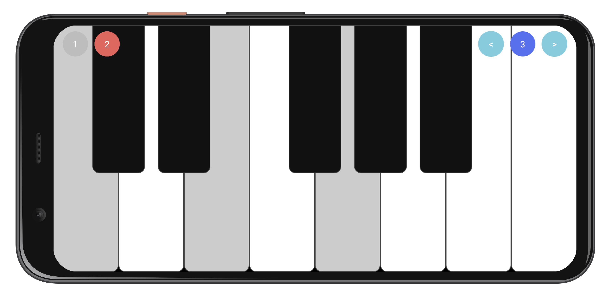

# Online Keyboard
これは、[おうちハッカソン](https://connpass.com/event/174573/) で作成したアプリケーションです。

* [server](https://github.com/Mori-Atsushi/home-hackathon-server)

## 機能
* 同時に複数人でkeyboardを演奏することができます。
* 左上に現在のメンバーと弾いているかどうかが表示されます。
* 右上の左右キーでオクターブを移動できます。
* 自分だけでなく、他人が弾いている場合も合わせてキーボードの色が変化します。

### スクリーンショット

## 環境
* [Android Studio 4.0 Beta 5](https://developer.android.com/studio/preview)
* [NDK 21.0.6113669](https://developer.android.com/studio/projects/install-ndk)

## ライブラリ
* [oboe](https://github.com/google/oboe)
* [kotlin](https://kotlinlang.org/)
    * [kotlin coroutines](https://github.com/Kotlin/kotlinx.coroutines)
* [androidx](https://developer.android.com/jetpack/androidx)
    * [appcompat](https://developer.android.com/jetpack/androidx/releases/appcompat)
    * [android ktx](https://developer.android.com/kotlin/ktx)
    * [constraintlayout](https://developer.android.com/reference/android/support/constraint/ConstraintLayout)
    * [lifecycle](https://developer.android.com/jetpack/androidx/releases/lifecycle)
    * [viewpager2](https://developer.android.com/jetpack/androidx/releases/viewpager2)
* [material-components](https://github.com/material-components/material-components-android)
* [epoxy](https://github.com/airbnb/epoxy)
* [koin](https://github.com/InsertKoinIO/koin)
* [grpc-java](https://github.com/grpc/grpc-java)
* [grpc-kotlin](https://github.com/grpc/grpc-kotlin)
